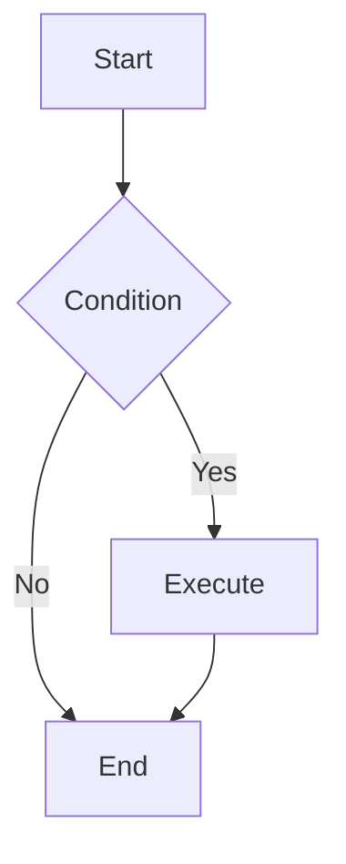

# Mermaid Diagram Generator

Generate high-quality Mermaid diagram code based on user requirements.

## Workflow

1. **Understand Requirements**: Analyze user description to determine the most suitable diagram type
2. **Read Documentation**: Read the corresponding syntax reference for the diagram type
3. **Generate Code**: Generate Mermaid code following the specification
4. **Apply Styling**: Apply appropriate themes and style configurations

## Diagram Type Reference

Select the appropriate diagram type and read the corresponding documentation:

| Type | Documentation | Use Cases |
| ---- | ------------- | --------- |
| Flowchart | [flowchart.md](docs/flowchart.md) | Processes, decisions, steps |
| Sequence Diagram | [sequenceDiagram.md](docs/sequenceDiagram.md) | Interactions, messaging, API calls |
| Class Diagram | [classDiagram.md](docs/classDiagram.md) | Class structure, inheritance, associations |
| State Diagram | [stateDiagram.md](docs/stateDiagram.md) | State machines, state transitions |
| ER Diagram | [entityRelationshipDiagram.md](docs/entityRelationshipDiagram.md) | Database design, entity relationships |
| Gantt Chart | [gantt.md](docs/gantt.md) | Project planning, timelines |
| Pie Chart | [pie.md](docs/pie.md) | Proportions, distributions |
| Mindmap | [mindmap.md](docs/mindmap.md) | Hierarchical structures, knowledge graphs |
| Timeline | [timeline.md](docs/timeline.md) | Historical events, milestones |
| Git Graph | [gitgraph.md](docs/gitgraph.md) | Branches, merges, versions |
| Quadrant Chart | [quadrantChart.md](docs/quadrantChart.md) | Four-quadrant analysis |
| Requirement Diagram | [requirementDiagram.md](docs/requirementDiagram.md) | Requirements traceability |
| C4 Diagram | [c4.md](docs/c4.md) | System architecture (C4 model) |
| Sankey Diagram | [sankey.md](docs/sankey.md) | Flow, conversions |
| XY Chart | [xyChart.md](docs/xyChart.md) | Line charts, bar charts |
| Block Diagram | [block.md](docs/block.md) | System components, modules |
| Packet Diagram | [packet.md](docs/packet.md) | Network protocols, data structures |
| Kanban | [kanban.md](docs/kanban.md) | Task management, workflows |
| Architecture Diagram | [architecture.md](docs/architecture.md) | System architecture |
| Radar Chart | [radar.md](docs/radar.md) | Multi-dimensional comparison |
| Treemap | [treemap.md](docs/treemap.md) | Hierarchical data visualization |
| User Journey | [userJourney.md](docs/userJourney.md) | User experience flows |
| ZenUML | [zenuml.md](docs/zenuml.md) | Sequence diagrams (code style) |

## Configuration & Themes

- [Theming](docs/config-theming.md) - Custom colors and styles
- [Directives](docs/config-directives.md) - Diagram-level configuration
- [Layouts](docs/config-layouts.md) - Layout direction and spacing
- [Configuration](docs/config-configuration.md) - Global settings
- [Math](docs/config-math.md) - LaTeX math support

## Output Specification

Generated Mermaid code should:

1. Be wrapped in ```mermaid code blocks
2. Have correct syntax that renders directly
3. Have clear structure with proper line breaks and indentation
4. Use semantic node naming
5. Include styling when needed to improve visual appearance

## Example Output



---

User requirements: $ARGUMENTS
